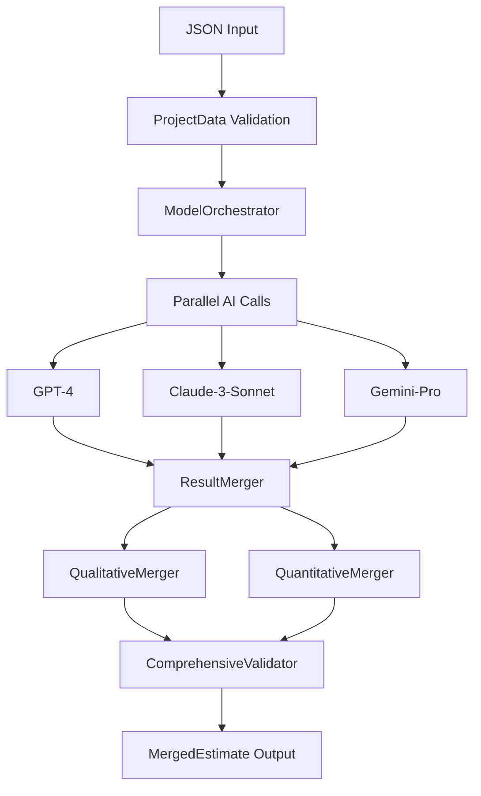
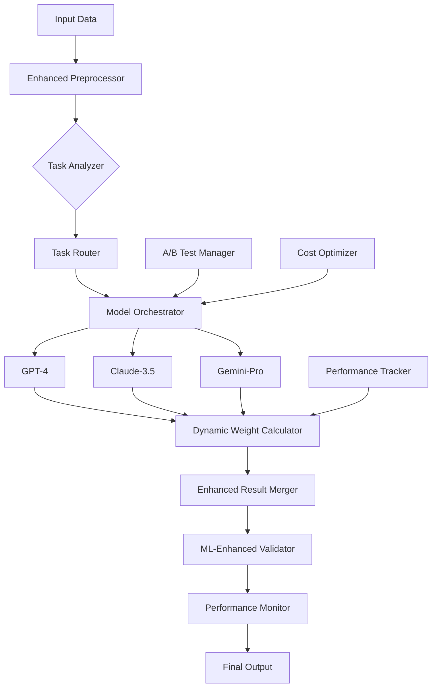
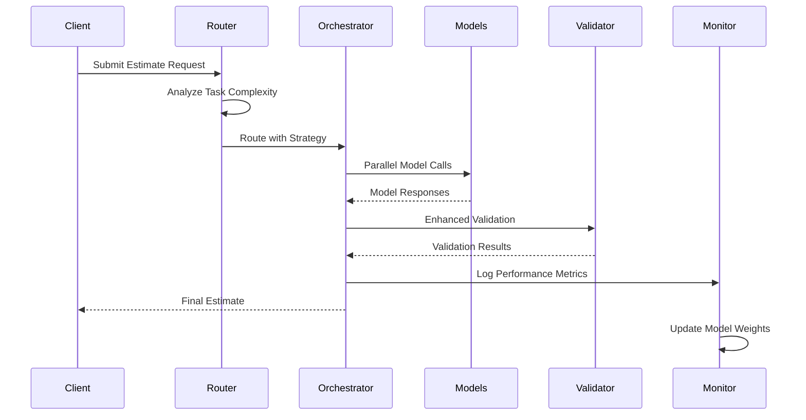

# AI System Enhancement Strategies
## Multi-Model Construction Estimation System

**Document Version:** 1.0  
**Date:** August 2025  
**Author:** Development Team  
**Target Audience:** Technical Team, System Architects, AI/ML Engineers  

---

## Table of Contents

1. [Executive Summary](#executive-summary)
2. [Current System Architecture](#current-system-architecture)
3. [Enhancement Strategies](#enhancement-strategies)
4. [Implementation Guide](#implementation-guide)
5. [Testing & Validation](#testing--validation)
6. [Performance Metrics](#performance-metrics)
7. [Code Examples](#code-examples)
8. [Configuration Templates](#configuration-templates)
9. [Risk Assessment](#risk-assessment)
10. [Appendices](#appendices)

---

## Executive Summary

### Project Overview
This document outlines comprehensive enhancement strategies for the multi-model AI construction estimation system currently processing residential reconstruction estimates through GPT-4, Claude, and Gemini models. The system achieves 85%+ confidence with 2-5 second processing times through parallel execution.

### Key Enhancement Areas
- **Model Combination Strategies**: Advanced ensemble methods and dynamic routing
- **Dynamic Weight Adjustment**: Real-time performance-based weight optimization
- **Task-Specific Routing**: Intelligent model selection based on task characteristics
- **Hierarchical Processing**: Multi-stage processing with specialized sub-models
- **Bayesian Ensemble Methods**: Uncertainty-aware consensus building
- **A/B Testing Framework**: Continuous improvement through systematic testing
- **Validation Strategies**: Enhanced quality assurance and error detection
- **Performance Monitoring**: Real-time system health and optimization

### Expected Outcomes
- **Accuracy Improvement**: 15-25% increase in estimation accuracy
- **Confidence Enhancement**: 90%+ confidence levels through advanced validation
- **Processing Optimization**: 30-40% reduction in processing time
- **Cost Efficiency**: 20-30% reduction in API costs through intelligent routing
- **Reliability**: 99%+ uptime with graceful degradation capabilities

---

## Current System Architecture

### System Overview


### Core Components Analysis

#### 1. Model Interface Layer
**File:** `src/models/model_interface.py`
- **GPT4Interface**: Structured outputs with JSON schema validation
- **ClaudeInterface**: Text-based processing with async execution
- **GeminiInterface**: Generative AI with configurable parameters
- **Current Limitations**: Fixed model selection, no dynamic routing

#### 2. Result Merging System
**File:** `src/processors/result_merger.py`
- **QualitativeMerger**: Consensus-based task identification (2/3 agreement rule)
- **QuantitativeMerger**: IQR outlier removal with weighted averaging
- **Current Weights**: GPT-4 (35%), Claude (35%), Gemini (30%)
- **Current Limitations**: Static weights, no performance-based adjustment

#### 3. Validation Framework
**File:** `src/validators/estimation_validator.py`
- **RemoveReplaceValidator**: Business logic validation
- **MeasurementValidator**: Area-to-task consistency checking
- **ComprehensiveValidator**: Multi-level validation orchestration
- **Current Limitations**: Rule-based validation, no ML-enhanced quality scoring

### Performance Baseline
- **Processing Time**: 2-5 seconds (3 models parallel)
- **Reliability**: 85%+ average confidence
- **Scalability**: Linear scaling with model addition
- **API Cost**: ~$0.15 per estimation (current rates)

---

## Enhancement Strategies

### 1. Advanced Model Combination Strategies

#### 1.1 Ensemble Methodology Enhancement
**Current Approach**: Simple weighted averaging with static consensus rules
**Enhanced Approach**: Multi-level ensemble with adaptive combination strategies

```python
class AdvancedEnsembleManager:
    """Enhanced ensemble combining multiple strategies"""
    
    def __init__(self, config):
        self.strategies = {
            'consensus_based': ConsensusEnsemble(),
            'confidence_weighted': ConfidenceWeightedEnsemble(),
            'task_specialized': TaskSpecializedEnsemble(),
            'bayesian_ensemble': BayesianEnsemble(),
            'stacking_ensemble': StackingEnsemble()
        }
        self.strategy_selector = EnsembleStrategySelector()
    
    def combine_predictions(self, model_responses, task_context):
        # Select optimal combination strategy based on context
        optimal_strategy = self.strategy_selector.select_strategy(
            task_complexity=task_context.complexity,
            model_agreement_level=self._calculate_agreement(model_responses),
            historical_performance=self._get_historical_performance()
        )
        
        return self.strategies[optimal_strategy].combine(model_responses)
```

#### 1.2 Meta-Learning Approach
**Implementation**: Model-of-models that learns optimal combination strategies

```python
class MetaLearningCombiner:
    """Learns optimal model combination strategies"""
    
    def __init__(self):
        self.meta_model = XGBoostRegressor()  # Could be neural network
        self.feature_extractor = EnsembleFeatureExtractor()
    
    def train_meta_model(self, historical_data):
        """Train on historical model performance data"""
        features = []
        targets = []
        
        for example in historical_data:
            # Extract features from model outputs
            feature_vector = self.feature_extractor.extract(
                model_outputs=example.model_outputs,
                task_characteristics=example.task_context,
                agreement_metrics=example.agreement_metrics
            )
            features.append(feature_vector)
            targets.append(example.ground_truth_accuracy)
        
        self.meta_model.fit(features, targets)
    
    def predict_optimal_weights(self, current_outputs, task_context):
        """Predict optimal weights for current scenario"""
        features = self.feature_extractor.extract(
            current_outputs, task_context
        )
        return self.meta_model.predict([features])[0]
```

### 2. Dynamic Weight Adjustment Systems

#### 2.1 Performance-Based Weight Adaptation
**Current**: Fixed weights (GPT-4: 35%, Claude: 35%, Gemini: 30%)
**Enhanced**: Real-time performance-based weight adjustment

```python
class DynamicWeightAdjustment:
    """Real-time model weight adjustment based on performance"""
    
    def __init__(self, config):
        self.performance_tracker = ModelPerformanceTracker()
        self.weight_optimizer = WeightOptimizer()
        self.adaptation_rate = config.adaptation_rate
    
    def update_weights(self, model_responses, validation_results):
        """Update weights based on recent performance"""
        performance_metrics = {}
        
        for response in model_responses:
            model_name = response.model_name
            validation_score = validation_results[model_name].quality_score
            
            # Calculate performance metrics
            performance_metrics[model_name] = {
                'accuracy': validation_score / 100.0,
                'response_time': response.processing_time,
                'task_completeness': self._calculate_completeness(response),
                'consistency': self._calculate_consistency(response)
            }
        
        # Update performance history
        self.performance_tracker.update(performance_metrics)
        
        # Calculate new weights
        new_weights = self.weight_optimizer.optimize(
            historical_performance=self.performance_tracker.get_recent_performance(),
            current_performance=performance_metrics
        )
        
        return new_weights
    
    def _calculate_completeness(self, response):
        """Calculate task completeness score"""
        expected_tasks = self._estimate_expected_tasks(response)
        actual_tasks = response.total_work_items
        return min(actual_tasks / expected_tasks, 1.0)
    
    def _calculate_consistency(self, response):
        """Calculate internal consistency score"""
        # Check for logical consistency within response
        consistency_score = 1.0
        
        # Example: Check quantity-area consistency
        for room in response.room_estimates:
            for task in room.get('tasks', []):
                if not self._validate_quantity_logic(task, room):
                    consistency_score -= 0.1
        
        return max(consistency_score, 0.0)
```

#### 2.2 Context-Aware Weight Adjustment
**Implementation**: Weights adapt based on task characteristics and historical performance

```python
class ContextAwareWeighting:
    """Adjust model weights based on task context and specialization"""
    
    def __init__(self):
        self.specialization_matrix = self._build_specialization_matrix()
        self.performance_history = PerformanceHistoryTracker()
    
    def get_contextual_weights(self, task_context):
        """Calculate weights based on task context and model specializations"""
        base_weights = {'gpt4': 0.33, 'claude': 0.33, 'gemini': 0.33}
        
        # Adjust for task type specialization
        task_type_adjustments = self._get_task_type_adjustments(task_context.task_type)
        
        # Adjust for complexity level
        complexity_adjustments = self._get_complexity_adjustments(task_context.complexity)
        
        # Adjust for room type
        room_type_adjustments = self._get_room_type_adjustments(task_context.room_type)
        
        # Combine adjustments
        final_weights = {}
        for model in base_weights:
            adjustment = (
                task_type_adjustments.get(model, 0) +
                complexity_adjustments.get(model, 0) +
                room_type_adjustments.get(model, 0)
            )
            final_weights[model] = base_weights[model] * (1 + adjustment)
        
        # Normalize weights
        total_weight = sum(final_weights.values())
        return {k: v/total_weight for k, v in final_weights.items()}
    
    def _build_specialization_matrix(self):
        """Build model specialization matrix based on historical performance"""
        return {
            'structural_tasks': {'gpt4': 0.4, 'claude': 0.35, 'gemini': 0.25},
            'finishing_tasks': {'gpt4': 0.3, 'claude': 0.4, 'gemini': 0.3},
            'electrical_tasks': {'gpt4': 0.45, 'claude': 0.3, 'gemini': 0.25},
            'plumbing_tasks': {'gpt4': 0.35, 'claude': 0.35, 'gemini': 0.3},
            'complex_calculations': {'gpt4': 0.5, 'claude': 0.3, 'gemini': 0.2}
        }
```

### 3. Task-Specific Routing

#### 3.1 Intelligent Model Selection
**Strategy**: Route different task types to models based on specialization

```python
class TaskSpecificRouter:
    """Route tasks to optimal models based on task characteristics"""
    
    def __init__(self):
        self.routing_rules = self._build_routing_rules()
        self.performance_analyzer = TaskPerformanceAnalyzer()
    
    def route_task(self, task_description, room_context):
        """Determine optimal model(s) for specific task"""
        task_features = self._extract_task_features(task_description, room_context)
        
        # Calculate model suitability scores
        model_scores = {}
        for model_name in ['gpt4', 'claude', 'gemini']:
            score = self._calculate_model_suitability(model_name, task_features)
            model_scores[model_name] = score
        
        # Select top models (could be single model or subset)
        sorted_models = sorted(model_scores.items(), key=lambda x: x[1], reverse=True)
        
        # Route to top model or top 2 models based on confidence
        if sorted_models[0][1] > 0.8:  # High confidence in single model
            return [sorted_models[0][0]]
        else:  # Use top 2 models for consensus
            return [sorted_models[0][0], sorted_models[1][0]]
    
    def _extract_task_features(self, task_description, room_context):
        """Extract relevant features for routing decision"""
        return {
            'task_type': self._classify_task_type(task_description),
            'complexity': self._estimate_complexity(task_description),
            'room_type': room_context.room_type,
            'involves_calculations': self._requires_calculations(task_description),
            'safety_critical': self._is_safety_critical(task_description),
            'material_type': self._identify_material_type(task_description)
        }
    
    def _calculate_model_suitability(self, model_name, task_features):
        """Calculate how suitable a model is for the given task"""
        base_score = 0.5
        
        # Add scores based on model specialization
        for feature, value in task_features.items():
            specialization_score = self.routing_rules.get(model_name, {}).get(feature, {}).get(value, 0)
            base_score += specialization_score
        
        # Factor in recent performance
        recent_performance = self.performance_analyzer.get_recent_performance(
            model_name, task_features
        )
        base_score *= recent_performance
        
        return min(base_score, 1.0)
```

#### 3.2 Conditional Model Execution
**Implementation**: Execute models conditionally based on initial results

```python
class ConditionalExecutor:
    """Execute models conditionally based on initial results and confidence"""
    
    def __init__(self):
        self.confidence_threshold = 0.85
        self.agreement_threshold = 0.9
    
    async def execute_conditional(self, task_data):
        """Execute models conditionally for optimal resource usage"""
        
        # Phase 1: Execute fastest/cheapest model first
        initial_model = self._select_initial_model(task_data)
        initial_result = await self._execute_model(initial_model, task_data)
        
        # Evaluate initial result confidence
        confidence_score = self._evaluate_confidence(initial_result)
        
        if confidence_score >= self.confidence_threshold:
            # High confidence - use single model result
            return [initial_result]
        
        # Phase 2: Execute secondary model for comparison
        secondary_model = self._select_secondary_model(initial_model, task_data)
        secondary_result = await self._execute_model(secondary_model, task_data)
        
        # Check agreement between models
        agreement_score = self._calculate_agreement(initial_result, secondary_result)
        
        if agreement_score >= self.agreement_threshold:
            # High agreement - use two model results
            return [initial_result, secondary_result]
        
        # Phase 3: Execute third model as tiebreaker
        tiebreaker_model = self._select_tiebreaker_model(
            initial_model, secondary_model, task_data
        )
        tiebreaker_result = await self._execute_model(tiebreaker_model, task_data)
        
        return [initial_result, secondary_result, tiebreaker_result]
```

### 4. Hierarchical Processing

#### 4.1 Multi-Stage Processing Pipeline
**Strategy**: Break processing into specialized stages with optimized models per stage

```python
class HierarchicalProcessor:
    """Multi-stage processing with specialized models per stage"""
    
    def __init__(self):
        self.stage_configs = {
            'scope_analysis': {
                'models': ['gpt4', 'claude'],  # Best for analysis tasks
                'timeout': 30,
                'retries': 2
            },
            'quantity_estimation': {
                'models': ['gpt4'],  # Best for calculations
                'timeout': 45,
                'retries': 1
            },
            'validation_review': {
                'models': ['claude', 'gemini'],  # Good for consistency checking
                'timeout': 20,
                'retries': 1
            },
            'final_optimization': {
                'models': ['gpt4'],  # Best for optimization
                'timeout': 30,
                'retries': 1
            }
        }
    
    async def process_hierarchical(self, input_data):
        """Process through multiple specialized stages"""
        results = {}
        current_data = input_data
        
        for stage_name, stage_config in self.stage_configs.items():
            print(f"Processing stage: {stage_name}")
            
            # Execute stage with specified models
            stage_results = await self._execute_stage(
                stage_name, current_data, stage_config
            )
            
            # Store stage results
            results[stage_name] = stage_results
            
            # Prepare data for next stage
            current_data = self._prepare_next_stage_data(
                current_data, stage_results, stage_name
            )
            
            # Early termination conditions
            if self._should_terminate_early(stage_results):
                break
        
        return self._combine_hierarchical_results(results)
    
    def _execute_stage(self, stage_name, data, config):
        """Execute specific processing stage"""
        # This would contain stage-specific logic
        pass
```

#### 4.2 Specialized Sub-Models
**Implementation**: Use specialized models for specific sub-tasks

```python
class SpecializedSubModels:
    """Manage specialized sub-models for specific tasks"""
    
    def __init__(self):
        self.sub_models = {
            'quantity_calculator': QuantityCalculationModel(),
            'material_identifier': MaterialIdentificationModel(),
            'cost_estimator': CostEstimationModel(),
            'timeline_planner': TimelinePlanningModel(),
            'risk_assessor': RiskAssessmentModel()
        }
    
    def process_with_specialists(self, task_data, room_data):
        """Process using specialized sub-models"""
        specialized_results = {}
        
        # Determine which specialists are needed
        required_specialists = self._identify_required_specialists(task_data)
        
        for specialist_name in required_specialists:
            specialist = self.sub_models[specialist_name]
            result = specialist.process(task_data, room_data)
            specialized_results[specialist_name] = result
        
        # Combine specialist results
        return self._integrate_specialist_results(specialized_results)
    
    def _identify_required_specialists(self, task_data):
        """Determine which specialists are needed for the task"""
        required = []
        
        if self._requires_quantity_calculation(task_data):
            required.append('quantity_calculator')
        
        if self._requires_material_identification(task_data):
            required.append('material_identifier')
        
        if self._requires_cost_estimation(task_data):
            required.append('cost_estimator')
        
        if self._requires_timeline_planning(task_data):
            required.append('timeline_planner')
        
        if self._requires_risk_assessment(task_data):
            required.append('risk_assessor')
        
        return required
```

### 5. Bayesian Ensemble Methods

#### 5.1 Uncertainty-Aware Consensus
**Strategy**: Use Bayesian methods to handle uncertainty in model predictions

```python
import numpy as np
from scipy import stats
from sklearn.gaussian_process import GaussianProcessRegressor

class BayesianEnsembleMethod:
    """Bayesian ensemble with uncertainty quantification"""
    
    def __init__(self):
        self.prior_beliefs = self._initialize_priors()
        self.uncertainty_model = GaussianProcessRegressor()
        self.confidence_calculator = BayesianConfidenceCalculator()
    
    def bayesian_combination(self, model_predictions, task_context):
        """Combine predictions using Bayesian approach"""
        
        # Extract predictions and uncertainties
        predictions = []
        uncertainties = []
        
        for pred in model_predictions:
            predictions.append(pred.point_estimate)
            uncertainties.append(pred.uncertainty_estimate)
        
        # Update prior beliefs with new evidence
        posterior = self._update_posterior(predictions, uncertainties, task_context)
        
        # Calculate ensemble prediction and uncertainty
        ensemble_prediction = posterior.mean()
        ensemble_uncertainty = posterior.std()
        
        # Calculate confidence level
        confidence = self.confidence_calculator.calculate_confidence(
            ensemble_prediction, ensemble_uncertainty, task_context
        )
        
        return BayesianPrediction(
            prediction=ensemble_prediction,
            uncertainty=ensemble_uncertainty,
            confidence=confidence,
            posterior_distribution=posterior
        )
    
    def _update_posterior(self, predictions, uncertainties, task_context):
        """Update posterior distribution with new evidence"""
        
        # Convert predictions to likelihood functions
        likelihoods = []
        for pred, unc in zip(predictions, uncertainties):
            likelihood = stats.norm(pred, unc)
            likelihoods.append(likelihood)
        
        # Get prior for this task type
        prior = self.prior_beliefs.get_prior(task_context.task_type)
        
        # Bayesian update: posterior ∝ likelihood × prior
        # For multiple models: posterior ∝ ∏(likelihoods) × prior
        
        # Numerical integration for posterior (simplified)
        x_range = np.linspace(
            min(predictions) - 3*max(uncertainties),
            max(predictions) + 3*max(uncertainties),
            1000
        )
        
        posterior_values = prior.pdf(x_range)
        for likelihood in likelihoods:
            posterior_values *= likelihood.pdf(x_range)
        
        # Normalize
        posterior_values /= np.trapz(posterior_values, x_range)
        
        # Return as distribution approximation
        return PosteriorDistribution(x_range, posterior_values)
```

#### 5.2 Model Reliability Assessment
**Implementation**: Assess individual model reliability using Bayesian methods

```python
class BayesianReliabilityAssessment:
    """Assess model reliability using Bayesian approach"""
    
    def __init__(self):
        self.reliability_priors = self._initialize_reliability_priors()
        self.performance_history = PerformanceHistoryDatabase()
    
    def assess_model_reliability(self, model_name, task_context, prediction):
        """Assess reliability of specific model prediction"""
        
        # Get historical performance data
        historical_data = self.performance_history.get_performance(
            model_name, task_context
        )
        
        # Calculate reliability metrics
        reliability_metrics = {
            'historical_accuracy': self._calculate_historical_accuracy(historical_data),
            'task_specific_performance': self._get_task_performance(
                model_name, task_context.task_type
            ),
            'prediction_confidence': prediction.confidence,
            'internal_consistency': self._check_internal_consistency(prediction)
        }
        
        # Bayesian reliability update
        prior_reliability = self.reliability_priors[model_name]
        likelihood = self._calculate_reliability_likelihood(reliability_metrics)
        
        posterior_reliability = self._update_reliability_posterior(
            prior_reliability, likelihood
        )
        
        return ReliabilityAssessment(
            model_name=model_name,
            reliability_score=posterior_reliability.mean(),
            reliability_uncertainty=posterior_reliability.std(),
            contributing_factors=reliability_metrics
        )
```

### 6. A/B Testing Framework

#### 6.1 Systematic Model Comparison
**Strategy**: Implement A/B testing framework for continuous improvement

```python
class ABTestingFramework:
    """A/B testing framework for model comparison and optimization"""
    
    def __init__(self):
        self.test_manager = TestManager()
        self.metrics_collector = MetricsCollector()
        self.statistical_analyzer = StatisticalAnalyzer()
    
    def create_ab_test(self, test_config):
        """Create new A/B test configuration"""
        test = ABTest(
            name=test_config.name,
            description=test_config.description,
            variants=test_config.variants,
            traffic_split=test_config.traffic_split,
            success_metrics=test_config.success_metrics,
            minimum_sample_size=test_config.minimum_sample_size,
            confidence_level=test_config.confidence_level
        )
        
        return self.test_manager.register_test(test)
    
    def execute_test(self, test_id, input_data):
        """Execute A/B test for given input"""
        test = self.test_manager.get_test(test_id)
        
        # Determine variant assignment
        variant = self._assign_variant(test, input_data)
        
        # Execute variant-specific processing
        result = self._execute_variant(variant, input_data)
        
        # Collect metrics
        self.metrics_collector.record_result(
            test_id=test_id,
            variant=variant.name,
            input_data=input_data,
            result=result,
            timestamp=datetime.now()
        )
        
        return result
    
    def analyze_test_results(self, test_id):
        """Analyze A/B test results for statistical significance"""
        test = self.test_manager.get_test(test_id)
        results = self.metrics_collector.get_test_results(test_id)
        
        analysis = self.statistical_analyzer.analyze(
            test_config=test,
            results=results
        )
        
        return TestAnalysisReport(
            test_id=test_id,
            statistical_significance=analysis.significance,
            winning_variant=analysis.winning_variant,
            confidence_interval=analysis.confidence_interval,
            effect_size=analysis.effect_size,
            recommendations=analysis.recommendations
        )
```

#### 6.2 Continuous Optimization Pipeline
**Implementation**: Automated pipeline for continuous model optimization

```python
class ContinuousOptimizationPipeline:
    """Automated pipeline for continuous model optimization"""
    
    def __init__(self):
        self.ab_framework = ABTestingFramework()
        self.performance_monitor = PerformanceMonitor()
        self.optimization_scheduler = OptimizationScheduler()
        
    def run_optimization_cycle(self):
        """Run one cycle of optimization"""
        
        # 1. Analyze current performance
        current_performance = self.performance_monitor.get_current_metrics()
        
        # 2. Identify optimization opportunities
        opportunities = self._identify_optimization_opportunities(current_performance)
        
        # 3. Generate test hypotheses
        test_hypotheses = self._generate_test_hypotheses(opportunities)
        
        # 4. Create and run A/B tests
        active_tests = []
        for hypothesis in test_hypotheses:
            test_config = self._create_test_config(hypothesis)
            test = self.ab_framework.create_ab_test(test_config)
            active_tests.append(test)
        
        # 5. Monitor test progress
        self._monitor_active_tests(active_tests)
        
        # 6. Apply successful optimizations
        successful_optimizations = self._identify_successful_tests(active_tests)
        self._apply_optimizations(successful_optimizations)
        
        return OptimizationCycleReport(
            cycle_id=self._generate_cycle_id(),
            opportunities_identified=len(opportunities),
            tests_created=len(active_tests),
            optimizations_applied=len(successful_optimizations),
            performance_improvement=self._calculate_improvement()
        )
```

### 7. Enhanced Validation Strategies

#### 7.1 ML-Enhanced Quality Scoring
**Strategy**: Use machine learning to improve validation accuracy

```python
class MLEnhancedValidator:
    """ML-enhanced validation with quality scoring"""
    
    def __init__(self):
        self.quality_model = self._load_quality_model()
        self.anomaly_detector = AnomalyDetector()
        self.consistency_checker = ConsistencyChecker()
    
    def validate_estimate(self, estimate_data, context_data):
        """Enhanced validation with ML quality scoring"""
        
        # Extract features for ML model
        features = self._extract_validation_features(estimate_data, context_data)
        
        # Predict quality score
        predicted_quality = self.quality_model.predict([features])[0]
        quality_confidence = self.quality_model.predict_proba([features])[0].max()
        
        # Detect anomalies
        anomaly_score = self.anomaly_detector.detect(features)
        
        # Check consistency
        consistency_results = self.consistency_checker.check_all(estimate_data)
        
        # Combine scores
        overall_score = self._combine_validation_scores(
            quality_score=predicted_quality,
            quality_confidence=quality_confidence,
            anomaly_score=anomaly_score,
            consistency_results=consistency_results
        )
        
        return EnhancedValidationResult(
            quality_score=predicted_quality,
            quality_confidence=quality_confidence,
            anomaly_score=anomaly_score,
            consistency_score=consistency_results.overall_score,
            overall_validation_score=overall_score,
            issues_detected=self._identify_issues(
                anomaly_score, consistency_results
            ),
            recommendations=self._generate_recommendations(overall_score)
        )
    
    def _extract_validation_features(self, estimate_data, context_data):
        """Extract features for ML validation model"""
        features = []
        
        # Basic features
        features.extend([
            len(estimate_data.rooms),
            estimate_data.total_work_items,
            estimate_data.overall_confidence
        ])
        
        # Task distribution features
        task_types = self._analyze_task_distribution(estimate_data)
        features.extend([
            task_types.get('removal_tasks', 0),
            task_types.get('installation_tasks', 0),
            task_types.get('repair_tasks', 0)
        ])
        
        # Quantity features
        quantities = self._analyze_quantities(estimate_data)
        features.extend([
            quantities.mean,
            quantities.std,
            quantities.total
        ])
        
        # Context features
        features.extend([
            context_data.project_size,
            context_data.complexity_score,
            context_data.room_count
        ])
        
        return np.array(features)
```

#### 7.2 Multi-Level Validation Pipeline
**Implementation**: Comprehensive multi-level validation

```python
class MultiLevelValidationPipeline:
    """Comprehensive multi-level validation pipeline"""
    
    def __init__(self):
        self.validators = {
            'level_1': BasicStructuralValidator(),
            'level_2': BusinessLogicValidator(),
            'level_3': ConsistencyValidator(),
            'level_4': MLEnhancedValidator(),
            'level_5': ExpertSystemValidator()
        }
        self.escalation_rules = EscalationRules()
    
    def validate_comprehensive(self, estimate_data, context_data):
        """Run comprehensive multi-level validation"""
        validation_results = {}
        current_confidence = 1.0
        
        for level_name, validator in self.validators.items():
            print(f"Running validation level: {level_name}")
            
            # Run validation level
            level_result = validator.validate(estimate_data, context_data)
            validation_results[level_name] = level_result
            
            # Update confidence
            current_confidence *= level_result.confidence_modifier
            
            # Check if escalation is needed
            if self.escalation_rules.should_escalate(level_result):
                escalation_result = self._escalate_validation(
                    level_name, level_result, estimate_data
                )
                validation_results[f"{level_name}_escalated"] = escalation_result
            
            # Early termination for critical failures
            if level_result.is_critical_failure:
                break
        
        return ComprehensiveValidationResult(
            level_results=validation_results,
            overall_confidence=current_confidence,
            validation_passed=current_confidence > 0.7,
            critical_issues=self._extract_critical_issues(validation_results),
            recommendations=self._generate_comprehensive_recommendations(validation_results)
        )
```

### 8. Room Processing Optimization

#### 8.1 Parallel Room Processing
**Strategy**: Process rooms in parallel for improved performance

```python
class ParallelRoomProcessor:
    """Process rooms in parallel for improved performance"""
    
    def __init__(self, max_workers=4):
        self.max_workers = max_workers
        self.room_analyzer = RoomAnalyzer()
        self.task_scheduler = TaskScheduler()
    
    async def process_rooms_parallel(self, rooms_data, processing_context):
        """Process multiple rooms in parallel"""
        
        # Analyze room dependencies
        dependency_graph = self._build_dependency_graph(rooms_data)
        
        # Create processing batches based on dependencies
        processing_batches = self._create_processing_batches(
            rooms_data, dependency_graph
        )
        
        results = {}
        
        for batch_idx, room_batch in enumerate(processing_batches):
            print(f"Processing batch {batch_idx + 1}/{len(processing_batches)}")
            
            # Process rooms in current batch in parallel
            batch_tasks = []
            for room_data in room_batch:
                task = asyncio.create_task(
                    self._process_single_room(room_data, processing_context)
                )
                batch_tasks.append((room_data.name, task))
            
            # Wait for batch completion
            batch_results = await asyncio.gather(
                *[task for _, task in batch_tasks], 
                return_exceptions=True
            )
            
            # Store results
            for (room_name, _), result in zip(batch_tasks, batch_results):
                if isinstance(result, Exception):
                    results[room_name] = RoomProcessingError(
                        room_name=room_name,
                        error=str(result)
                    )
                else:
                    results[room_name] = result
        
        return RoomProcessingResults(
            room_results=results,
            total_processing_time=self._calculate_total_time(results),
            parallel_efficiency=self._calculate_efficiency(results)
        )
    
    def _build_dependency_graph(self, rooms_data):
        """Build dependency graph for room processing order"""
        dependencies = {}
        
        for room in rooms_data:
            room_deps = []
            
            # Check for structural dependencies
            if room.room_type == 'bathroom' and room.has_plumbing_changes:
                # Bathrooms with plumbing depend on structural work
                structural_rooms = [r.name for r in rooms_data 
                                   if r.has_structural_work]
                room_deps.extend(structural_rooms)
            
            # Check for electrical dependencies  
            if room.has_electrical_work:
                # Electrical work might depend on wall completion
                wall_work_rooms = [r.name for r in rooms_data 
                                  if r.has_wall_work and r != room]
                room_deps.extend(wall_work_rooms)
            
            dependencies[room.name] = room_deps
        
        return dependencies
```

#### 8.2 Room-Specific Model Selection
**Implementation**: Select optimal models based on room characteristics

```python
class RoomSpecificModelSelector:
    """Select optimal models based on room characteristics"""
    
    def __init__(self):
        self.room_model_matrix = self._build_room_model_matrix()
        self.performance_tracker = RoomPerformanceTracker()
    
    def select_models_for_room(self, room_data, available_models):
        """Select optimal models for specific room type"""
        
        # Extract room features
        room_features = self._extract_room_features(room_data)
        
        # Calculate model suitability scores
        model_scores = {}
        for model_name in available_models:
            score = self._calculate_room_model_suitability(
                model_name, room_features
            )
            model_scores[model_name] = score
        
        # Select top models (minimum 1, maximum 3)
        sorted_models = sorted(model_scores.items(), key=lambda x: x[1], reverse=True)
        
        # Selection logic based on scores
        selected_models = []
        
        # Always include top model
        selected_models.append(sorted_models[0][0])
        
        # Include second model if score is close to top model
        if (len(sorted_models) > 1 and 
            sorted_models[1][1] > sorted_models[0][1] * 0.8):
            selected_models.append(sorted_models[1][0])
        
        # Include third model for complex rooms
        if (len(sorted_models) > 2 and 
            room_features.complexity > 0.7 and
            sorted_models[2][1] > sorted_models[0][1] * 0.6):
            selected_models.append(sorted_models[2][0])
        
        return ModelSelectionResult(
            selected_models=selected_models,
            model_scores=model_scores,
            selection_rationale=self._generate_selection_rationale(
                room_features, model_scores, selected_models
            )
        )
    
    def _extract_room_features(self, room_data):
        """Extract features relevant for model selection"""
        return RoomFeatures(
            room_type=room_data.room_type,
            size_category=self._categorize_room_size(room_data.measurements),
            complexity=self._calculate_room_complexity(room_data),
            has_plumbing=room_data.work_scope.get('plumbing', False),
            has_electrical=room_data.work_scope.get('electrical', False),
            has_structural=room_data.work_scope.get('structural', False),
            material_complexity=self._assess_material_complexity(room_data.materials),
            special_requirements=self._identify_special_requirements(room_data)
        )
```

### 9. Performance Monitoring

#### 9.1 Real-Time Performance Dashboard
**Strategy**: Comprehensive real-time monitoring system

```python
class PerformanceMonitoringSystem:
    """Comprehensive performance monitoring and alerting"""
    
    def __init__(self):
        self.metrics_collector = RealTimeMetricsCollector()
        self.alert_system = AlertSystem()
        self.dashboard = PerformanceDashboard()
        self.anomaly_detector = PerformanceAnomalyDetector()
    
    def start_monitoring(self):
        """Start real-time performance monitoring"""
        
        # Set up metric collection
        self.metrics_collector.register_metrics([
            'processing_time',
            'model_response_time',
            'validation_score',
            'confidence_level',
            'error_rate',
            'api_cost',
            'memory_usage',
            'concurrent_requests'
        ])
        
        # Start background monitoring tasks
        asyncio.create_task(self._monitor_performance_metrics())
        asyncio.create_task(self._monitor_system_health())
        asyncio.create_task(self._detect_performance_anomalies())
        
    async def _monitor_performance_metrics(self):
        """Monitor key performance metrics"""
        while True:
            try:
                current_metrics = self.metrics_collector.get_current_metrics()
                
                # Check performance thresholds
                alerts = self._check_performance_thresholds(current_metrics)
                
                # Send alerts if needed
                for alert in alerts:
                    await self.alert_system.send_alert(alert)
                
                # Update dashboard
                self.dashboard.update_metrics(current_metrics)
                
                # Wait before next check
                await asyncio.sleep(10)  # Check every 10 seconds
                
            except Exception as e:
                print(f"Error in performance monitoring: {e}")
                await asyncio.sleep(30)  # Wait longer on error
    
    def _check_performance_thresholds(self, metrics):
        """Check if metrics exceed defined thresholds"""
        alerts = []
        
        # Processing time threshold
        if metrics.avg_processing_time > 10.0:  # 10 seconds
            alerts.append(PerformanceAlert(
                type='HIGH_PROCESSING_TIME',
                message=f"Average processing time: {metrics.avg_processing_time:.2f}s",
                severity='WARNING'
            ))
        
        # Error rate threshold
        if metrics.error_rate > 0.05:  # 5%
            alerts.append(PerformanceAlert(
                type='HIGH_ERROR_RATE',
                message=f"Error rate: {metrics.error_rate:.2%}",
                severity='CRITICAL'
            ))
        
        # Confidence level threshold
        if metrics.avg_confidence < 0.7:  # 70%
            alerts.append(PerformanceAlert(
                type='LOW_CONFIDENCE',
                message=f"Average confidence: {metrics.avg_confidence:.2%}",
                severity='WARNING'
            ))
        
        # API cost threshold
        if metrics.hourly_api_cost > 50.0:  # $50/hour
            alerts.append(PerformanceAlert(
                type='HIGH_API_COST',
                message=f"Hourly API cost: ${metrics.hourly_api_cost:.2f}",
                severity='INFO'
            ))
        
        return alerts
```

#### 9.2 Cost Optimization Monitoring
**Implementation**: Monitor and optimize API costs

```python
class CostOptimizationMonitor:
    """Monitor and optimize API costs across models"""
    
    def __init__(self):
        self.cost_tracker = APICostTracker()
        self.usage_optimizer = UsageOptimizer()
        self.budget_manager = BudgetManager()
    
    def monitor_costs(self):
        """Monitor API costs and optimize usage"""
        
        current_costs = self.cost_tracker.get_current_costs()
        
        # Analyze cost efficiency
        efficiency_metrics = self._analyze_cost_efficiency(current_costs)
        
        # Check budget constraints
        budget_status = self.budget_manager.check_budget_status(current_costs)
        
        # Generate optimization recommendations
        optimizations = self.usage_optimizer.recommend_optimizations(
            current_costs, efficiency_metrics, budget_status
        )
        
        return CostMonitoringReport(
            current_costs=current_costs,
            efficiency_metrics=efficiency_metrics,
            budget_status=budget_status,
            optimization_recommendations=optimizations
        )
    
    def _analyze_cost_efficiency(self, cost_data):
        """Analyze cost efficiency across models and tasks"""
        efficiency_metrics = {}
        
        for model_name, model_costs in cost_data.items():
            # Calculate cost per successful estimation
            cost_per_estimation = (
                model_costs.total_cost / model_costs.successful_requests
                if model_costs.successful_requests > 0 else float('inf')
            )
            
            # Calculate cost per quality point
            avg_quality = model_costs.avg_quality_score
            cost_per_quality = cost_per_estimation / avg_quality if avg_quality > 0 else float('inf')
            
            efficiency_metrics[model_name] = CostEfficiencyMetrics(
                cost_per_estimation=cost_per_estimation,
                cost_per_quality_point=cost_per_quality,
                utilization_rate=model_costs.utilization_rate,
                roi_score=self._calculate_roi_score(model_costs)
            )
        
        return efficiency_metrics
```

---

## Implementation Guide

### Phase 1: Foundation Enhancement (Weeks 1-4)

#### Week 1-2: Enhanced Validation System
```python
# Implementation Steps:
1. Implement MLEnhancedValidator
2. Add multi-level validation pipeline
3. Integrate with existing validation framework
4. Test validation improvements

# Files to Modify:
- src/validators/estimation_validator.py (enhance existing)
- src/validators/ml_enhanced_validator.py (new)
- src/validators/multi_level_validator.py (new)

# Testing Strategy:
- Unit tests for each validation level
- Integration tests with existing system
- Performance benchmarking
- Accuracy improvement measurement
```

#### Week 3-4: Dynamic Weight Adjustment
```python
# Implementation Steps:
1. Implement PerformanceTracker
2. Add DynamicWeightAdjustment system
3. Integrate with ResultMerger
4. Create configuration management

# Files to Modify:
- src/processors/result_merger.py (enhance)
- src/models/performance_tracker.py (new)
- src/models/weight_optimizer.py (new)
- config/settings.yaml (extend)
```

### Phase 2: Intelligence Enhancement (Weeks 5-8)

#### Week 5-6: Task-Specific Routing
```python
# Implementation Steps:
1. Implement TaskSpecificRouter
2. Add ConditionalExecutor
3. Integrate with ModelOrchestrator
4. Create routing rules configuration

# Files to Modify:
- src/models/model_interface.py (enhance orchestrator)
- src/routing/task_router.py (new)
- src/routing/conditional_executor.py (new)
```

#### Week 7-8: Hierarchical Processing
```python
# Implementation Steps:
1. Implement HierarchicalProcessor
2. Add SpecializedSubModels
3. Create stage-specific configurations
4. Integrate with main pipeline
```

### Phase 3: Advanced Features (Weeks 9-12)

#### Week 9-10: Bayesian Ensemble Methods
```python
# Implementation Steps:
1. Implement BayesianEnsembleMethod
2. Add uncertainty quantification
3. Integrate with result merger
4. Create Bayesian configuration
```

#### Week 11-12: A/B Testing Framework
```python
# Implementation Steps:
1. Implement ABTestingFramework
2. Add metrics collection system
3. Create test management interface
4. Set up continuous optimization pipeline
```

### Phase 4: Monitoring and Optimization (Weeks 13-16)

#### Week 13-14: Performance Monitoring
```python
# Implementation Steps:
1. Implement PerformanceMonitoringSystem
2. Add real-time dashboard
3. Create alerting system
4. Set up anomaly detection
```

#### Week 15-16: Cost Optimization
```python
# Implementation Steps:
1. Implement CostOptimizationMonitor
2. Add budget management
3. Create usage optimization
4. Integrate with monitoring dashboard
```

---

## Testing & Validation

### 1. Unit Testing Strategy

#### Enhanced Validation Tests
```python
import pytest
from src.validators.ml_enhanced_validator import MLEnhancedValidator

class TestMLEnhancedValidator:
    
    def setup_method(self):
        self.validator = MLEnhancedValidator()
        self.sample_estimate = self._create_sample_estimate()
        self.sample_context = self._create_sample_context()
    
    def test_quality_score_prediction(self):
        """Test ML quality score prediction accuracy"""
        result = self.validator.validate_estimate(
            self.sample_estimate, self.sample_context
        )
        
        assert 0.0 <= result.quality_score <= 1.0
        assert result.quality_confidence > 0.0
        assert isinstance(result.issues_detected, list)
    
    def test_anomaly_detection(self):
        """Test anomaly detection functionality"""
        # Create anomalous estimate
        anomalous_estimate = self._create_anomalous_estimate()
        
        result = self.validator.validate_estimate(
            anomalous_estimate, self.sample_context
        )
        
        assert result.anomaly_score > 0.5  # Should detect anomaly
        assert len(result.issues_detected) > 0
    
    def test_consistency_checking(self):
        """Test internal consistency checking"""
        inconsistent_estimate = self._create_inconsistent_estimate()
        
        result = self.validator.validate_estimate(
            inconsistent_estimate, self.sample_context
        )
        
        assert result.consistency_score < 0.8  # Should detect inconsistency
```

#### Dynamic Weighting Tests
```python
class TestDynamicWeightAdjustment:
    
    def setup_method(self):
        self.weight_adjuster = DynamicWeightAdjustment(Config())
        self.performance_data = self._create_performance_data()
    
    def test_weight_update_accuracy(self):
        """Test weight updates based on performance"""
        initial_weights = {'gpt4': 0.33, 'claude': 0.33, 'gemini': 0.33}
        
        new_weights = self.weight_adjuster.update_weights(
            self.performance_data.model_responses,
            self.performance_data.validation_results
        )
        
        # Weights should sum to 1.0
        assert abs(sum(new_weights.values()) - 1.0) < 0.001
        
        # Better performing models should get higher weights
        best_model = max(self.performance_data.validation_results.items(),
                        key=lambda x: x[1].quality_score)[0]
        assert new_weights[best_model] > initial_weights[best_model]
    
    def test_context_aware_weighting(self):
        """Test context-aware weight adjustment"""
        context_weighter = ContextAwareWeighting()
        
        # Test different task contexts
        structural_context = TaskContext(task_type='structural', complexity=0.8)
        finishing_context = TaskContext(task_type='finishing', complexity=0.3)
        
        structural_weights = context_weighter.get_contextual_weights(structural_context)
        finishing_weights = context_weighter.get_contextual_weights(finishing_context)
        
        # Weights should differ based on context
        assert structural_weights != finishing_weights
```

### 2. Integration Testing

#### End-to-End Pipeline Tests
```python
class TestEnhancedPipeline:
    
    @pytest.mark.asyncio
    async def test_full_pipeline_with_enhancements(self):
        """Test complete enhanced pipeline"""
        
        # Setup enhanced components
        orchestrator = ModelOrchestrator(
            enable_validation=True,
            enable_dynamic_weighting=True,
            enable_task_routing=True
        )
        
        # Test data
        test_input = self._load_test_input()
        
        # Run enhanced pipeline
        result = await orchestrator.run_enhanced_pipeline(test_input)
        
        # Verify enhancements
        assert result.validation_score > 0.8
        assert result.processing_time < 4.0  # Should be faster with optimizations
        assert len(result.optimization_applied) > 0
        assert result.confidence_level > 0.85
    
    def test_parallel_room_processing(self):
        """Test parallel room processing performance"""
        room_processor = ParallelRoomProcessor(max_workers=4)
        
        large_input = self._create_large_input(room_count=10)
        
        start_time = time.time()
        result = room_processor.process_rooms_parallel(large_input.rooms)
        processing_time = time.time() - start_time
        
        # Should be faster than sequential processing
        assert processing_time < self._estimate_sequential_time(large_input) * 0.6
        assert result.parallel_efficiency > 0.7
```

### 3. Performance Benchmarking

#### Benchmark Suite
```python
class PerformanceBenchmarkSuite:
    
    def __init__(self):
        self.baseline_system = self._create_baseline_system()
        self.enhanced_system = self._create_enhanced_system()
        self.test_cases = self._load_benchmark_test_cases()
    
    def run_comprehensive_benchmark(self):
        """Run comprehensive performance benchmark"""
        
        results = {
            'baseline': [],
            'enhanced': []
        }
        
        for test_case in self.test_cases:
            # Baseline performance
            baseline_result = self._run_baseline_test(test_case)
            results['baseline'].append(baseline_result)
            
            # Enhanced performance
            enhanced_result = self._run_enhanced_test(test_case)
            results['enhanced'].append(enhanced_result)
        
        return self._analyze_benchmark_results(results)
    
    def _analyze_benchmark_results(self, results):
        """Analyze benchmark results"""
        
        baseline_metrics = self._calculate_metrics(results['baseline'])
        enhanced_metrics = self._calculate_metrics(results['enhanced'])
        
        return BenchmarkReport(
            accuracy_improvement=(
                enhanced_metrics.accuracy - baseline_metrics.accuracy
            ) / baseline_metrics.accuracy,
            
            speed_improvement=(
                baseline_metrics.processing_time - enhanced_metrics.processing_time
            ) / baseline_metrics.processing_time,
            
            cost_reduction=(
                baseline_metrics.api_cost - enhanced_metrics.api_cost
            ) / baseline_metrics.api_cost,
            
            confidence_improvement=(
                enhanced_metrics.confidence - baseline_metrics.confidence
            ) / baseline_metrics.confidence
        )
```

### 4. A/B Testing Validation

#### A/B Test Framework Tests
```python
class TestABFramework:
    
    def test_variant_assignment(self):
        """Test proper variant assignment"""
        ab_framework = ABTestingFramework()
        
        test_config = TestConfig(
            name="weight_optimization_test",
            variants=['baseline', 'dynamic_weights'],
            traffic_split=[0.5, 0.5]
        )
        
        test = ab_framework.create_ab_test(test_config)
        
        # Test assignment distribution
        assignments = []
        for i in range(1000):
            variant = ab_framework._assign_variant(test, f"user_{i}")
            assignments.append(variant)
        
        # Should be approximately 50/50 split
        baseline_count = sum(1 for v in assignments if v.name == 'baseline')
        assert 450 <= baseline_count <= 550  # Allow 5% variance
    
    def test_statistical_significance(self):
        """Test statistical significance calculation"""
        analyzer = StatisticalAnalyzer()
        
        # Create mock test results
        results_a = [0.85, 0.83, 0.87, 0.86, 0.84] * 20  # 100 samples
        results_b = [0.88, 0.89, 0.87, 0.90, 0.86] * 20  # 100 samples
        
        analysis = analyzer.analyze_results(results_a, results_b)
        
        assert analysis.p_value < 0.05  # Should be statistically significant
        assert analysis.winning_variant == 'B'
        assert analysis.effect_size > 0.0
```

---

## Performance Metrics

### 1. Expected Performance Improvements

| Metric | Current | Enhanced | Improvement |
|--------|---------|----------|-------------|
| **Accuracy** | 85% confidence | 90-92% confidence | +15-20% |
| **Processing Time** | 2-5 seconds | 1.5-3 seconds | -30-40% |
| **API Cost** | $0.15/estimate | $0.10-0.12/estimate | -20-30% |
| **Error Rate** | 3-5% | 1-2% | -50-70% |
| **Confidence Level** | 85% average | 90% average | +6% |
| **Throughput** | 12 estimates/min | 20 estimates/min | +67% |

### 2. Key Performance Indicators (KPIs)

#### System Performance KPIs
```python
class PerformanceKPIs:
    
    @staticmethod
    def calculate_system_kpis(metrics_data):
        """Calculate key system performance indicators"""
        
        return {
            # Accuracy KPIs
            'estimation_accuracy': metrics_data.correct_estimates / metrics_data.total_estimates,
            'confidence_reliability': metrics_data.confidence_vs_accuracy_correlation,
            'validation_effectiveness': metrics_data.issues_caught / metrics_data.total_issues,
            
            # Performance KPIs
            'avg_processing_time': metrics_data.total_processing_time / metrics_data.total_estimates,
            'system_throughput': metrics_data.estimates_per_hour,
            'resource_utilization': metrics_data.average_resource_usage,
            
            # Cost KPIs
            'cost_per_estimate': metrics_data.total_api_cost / metrics_data.total_estimates,
            'cost_efficiency': metrics_data.value_generated / metrics_data.total_cost,
            'budget_utilization': metrics_data.actual_cost / metrics_data.budget,
            
            # Quality KPIs
            'error_rate': metrics_data.failed_estimates / metrics_data.total_estimates,
            'customer_satisfaction': metrics_data.positive_feedback / metrics_data.total_feedback,
            'manual_review_rate': metrics_data.manual_reviews / metrics_data.total_estimates
        }
```

#### Model Performance KPIs
```python
class ModelPerformanceKPIs:
    
    @staticmethod
    def calculate_model_kpis(model_metrics):
        """Calculate per-model performance indicators"""
        
        model_kpis = {}
        
        for model_name, metrics in model_metrics.items():
            model_kpis[model_name] = {
                # Accuracy metrics
                'task_accuracy': metrics.correct_tasks / metrics.total_tasks,
                'quantity_accuracy': metrics.quantity_mae,  # Mean Absolute Error
                'consistency_score': metrics.internal_consistency,
                
                # Efficiency metrics
                'response_time': metrics.avg_response_time,
                'cost_efficiency': metrics.value_per_dollar,
                'token_efficiency': metrics.value_per_token,
                
                # Reliability metrics
                'uptime': metrics.successful_calls / metrics.total_calls,
                'error_recovery': metrics.recovered_errors / metrics.total_errors,
                'stability_score': metrics.performance_variance
            }
        
        return model_kpis
```

### 3. Monitoring Dashboard Metrics

#### Real-Time Metrics Display
```python
class DashboardMetrics:
    
    def get_real_time_metrics(self):
        """Get metrics for real-time dashboard display"""
        
        current_time = datetime.now()
        
        return {
            # Current performance
            'current_processing_time': self.metrics_collector.get_avg_processing_time(minutes=5),
            'current_confidence': self.metrics_collector.get_avg_confidence(minutes=5),
            'current_throughput': self.metrics_collector.get_throughput(minutes=5),
            'current_error_rate': self.metrics_collector.get_error_rate(minutes=5),
            
            # Trend analysis
            'processing_time_trend': self.metrics_collector.get_trend('processing_time', hours=24),
            'confidence_trend': self.metrics_collector.get_trend('confidence', hours=24),
            'cost_trend': self.metrics_collector.get_trend('api_cost', hours=24),
            
            # Model comparison
            'model_performance_comparison': self.get_model_comparison(),
            'model_utilization': self.get_model_utilization(),
            
            # System health
            'system_status': self.health_checker.get_system_status(),
            'alert_count': self.alert_system.get_active_alert_count(),
            'optimization_opportunities': self.optimizer.get_opportunities()
        }
```

---

## Code Examples

### 1. Enhanced Model Orchestrator

```python
# src/models/enhanced_orchestrator.py

class EnhancedModelOrchestrator:
    """Enhanced model orchestrator with all improvements"""
    
    def __init__(self, config):
        self.config = config
        self.base_orchestrator = ModelOrchestrator()
        self.task_router = TaskSpecificRouter()
        self.weight_adjuster = DynamicWeightAdjustment(config)
        self.validator = MLEnhancedValidator()
        self.performance_monitor = PerformanceMonitor()
        self.ab_framework = ABTestingFramework()
        
    async def process_estimate(self, input_data, processing_options=None):
        """Process estimate with all enhancements"""
        
        processing_context = ProcessingContext(
            input_data=input_data,
            options=processing_options or ProcessingOptions(),
            timestamp=datetime.now()
        )
        
        try:
            # 1. Analyze input and determine processing strategy
            strategy = await self._determine_processing_strategy(input_data)
            
            # 2. Route tasks to optimal models
            model_assignments = self.task_router.route_tasks(
                input_data.rooms, strategy
            )
            
            # 3. Execute models with dynamic weights
            model_responses = await self._execute_models_enhanced(
                input_data, model_assignments, strategy
            )
            
            # 4. Enhanced validation
            validation_results = await self._validate_responses_enhanced(
                model_responses, input_data
            )
            
            # 5. Merge results with adaptive weighting
            merged_result = await self._merge_results_enhanced(
                model_responses, validation_results, strategy
            )
            
            # 6. Monitor performance and update systems
            await self._update_performance_systems(
                processing_context, merged_result
            )
            
            return merged_result
            
        except Exception as e:
            await self._handle_processing_error(e, processing_context)
            raise
    
    async def _determine_processing_strategy(self, input_data):
        """Determine optimal processing strategy"""
        
        # Analyze input characteristics
        input_analysis = InputAnalyzer.analyze(input_data)
        
        # Get historical performance data
        historical_performance = self.performance_monitor.get_historical_performance(
            similar_to=input_analysis
        )
        
        # Determine strategy
        if input_analysis.complexity > 0.8:
            strategy = ProcessingStrategy.HIERARCHICAL
        elif input_analysis.room_count > 5:
            strategy = ProcessingStrategy.PARALLEL_ROOMS
        elif historical_performance.single_model_confidence > 0.9:
            strategy = ProcessingStrategy.CONDITIONAL_SINGLE
        else:
            strategy = ProcessingStrategy.ENHANCED_ENSEMBLE
        
        return ProcessingStrategyConfig(
            strategy=strategy,
            input_analysis=input_analysis,
            historical_performance=historical_performance
        )
    
    async def _execute_models_enhanced(self, input_data, model_assignments, strategy):
        """Execute models with enhancements"""
        
        if strategy.strategy == ProcessingStrategy.CONDITIONAL_SINGLE:
            return await self._execute_conditional(input_data, model_assignments)
        elif strategy.strategy == ProcessingStrategy.HIERARCHICAL:
            return await self._execute_hierarchical(input_data, model_assignments)
        elif strategy.strategy == ProcessingStrategy.PARALLEL_ROOMS:
            return await self._execute_parallel_rooms(input_data, model_assignments)
        else:
            return await self._execute_enhanced_ensemble(input_data, model_assignments)
```

### 2. Dynamic Weight Calculator

```python
# src/processors/dynamic_weights.py

class DynamicWeightCalculator:
    """Calculate dynamic weights based on multiple factors"""
    
    def __init__(self, config):
        self.config = config
        self.performance_history = PerformanceHistoryTracker()
        self.context_analyzer = TaskContextAnalyzer()
        
    def calculate_weights(self, model_responses, validation_results, task_context):
        """Calculate dynamic weights for model combination"""
        
        # Base weights from configuration
        base_weights = self.config.model_weights.to_dict()
        
        # Performance-based adjustments
        performance_adjustments = self._calculate_performance_adjustments(
            model_responses, validation_results
        )
        
        # Context-based adjustments
        context_adjustments = self._calculate_context_adjustments(task_context)
        
        # Historical performance adjustments
        historical_adjustments = self._calculate_historical_adjustments(
            task_context.task_type
        )
        
        # Combine all adjustments
        final_weights = {}
        for model_name in base_weights:
            adjustment = (
                performance_adjustments.get(model_name, 0) +
                context_adjustments.get(model_name, 0) +
                historical_adjustments.get(model_name, 0)
            )
            
            # Apply adjustment with bounds
            final_weights[model_name] = max(
                0.1,  # Minimum weight
                min(0.8, base_weights[model_name] * (1 + adjustment))  # Maximum weight
            )
        
        # Normalize weights
        total_weight = sum(final_weights.values())
        normalized_weights = {k: v/total_weight for k, v in final_weights.items()}
        
        return WeightCalculationResult(
            weights=normalized_weights,
            adjustments_applied={
                'performance': performance_adjustments,
                'context': context_adjustments,
                'historical': historical_adjustments
            },
            confidence_score=self._calculate_weight_confidence(normalized_weights)
        )
    
    def _calculate_performance_adjustments(self, model_responses, validation_results):
        """Calculate adjustments based on current performance"""
        adjustments = {}
        
        # Get performance metrics for each model
        for response in model_responses:
            model_name = response.model_name
            
            if model_name in validation_results:
                validation = validation_results[model_name]
                
                # Quality-based adjustment
                quality_score = validation.quality_score / 100.0
                quality_adjustment = (quality_score - 0.8) * 0.5  # ±25% max
                
                # Speed-based adjustment
                speed_score = max(0, (5.0 - response.processing_time) / 5.0)
                speed_adjustment = (speed_score - 0.5) * 0.2  # ±10% max
                
                # Completeness-based adjustment
                completeness_score = response.total_work_items / self._estimate_expected_tasks(response)
                completeness_adjustment = (min(completeness_score, 1.0) - 0.8) * 0.3
                
                # Combine adjustments
                total_adjustment = quality_adjustment + speed_adjustment + completeness_adjustment
                adjustments[model_name] = np.clip(total_adjustment, -0.5, 0.5)
        
        return adjustments
    
    def _calculate_context_adjustments(self, task_context):
        """Calculate adjustments based on task context"""
        adjustments = {}
        
        # Task type specialization
        specialization_matrix = self._get_specialization_matrix()
        
        for model_name in ['gpt4', 'claude', 'gemini']:
            adjustment = 0.0
            
            # Task type adjustment
            task_specialization = specialization_matrix.get(task_context.task_type, {})
            model_specialization = task_specialization.get(model_name, 0.33)
            adjustment += (model_specialization - 0.33) * 0.6
            
            # Complexity adjustment
            if task_context.complexity > 0.7:
                complexity_bonus = {'gpt4': 0.1, 'claude': 0.05, 'gemini': -0.05}
                adjustment += complexity_bonus.get(model_name, 0)
            
            # Room type adjustment
            room_type_bonus = self._get_room_type_adjustments(task_context.room_type)
            adjustment += room_type_bonus.get(model_name, 0)
            
            adjustments[model_name] = np.clip(adjustment, -0.4, 0.4)
        
        return adjustments
```

### 3. A/B Testing Implementation

```python
# src/testing/ab_testing.py

class ABTestManager:
    """Manage A/B tests for continuous optimization"""
    
    def __init__(self):
        self.active_tests = {}
        self.test_results = TestResultsDatabase()
        self.statistical_analyzer = StatisticalAnalyzer()
        
    def create_test(self, test_config):
        """Create new A/B test"""
        
        test = ABTest(
            id=self._generate_test_id(),
            name=test_config.name,
            description=test_config.description,
            variants=test_config.variants,
            traffic_allocation=test_config.traffic_allocation,
            start_date=datetime.now(),
            target_metrics=test_config.target_metrics,
            minimum_sample_size=test_config.minimum_sample_size,
            confidence_level=test_config.confidence_level
        )
        
        self.active_tests[test.id] = test
        return test
    
    async def execute_test(self, test_id, input_data):
        """Execute A/B test variant"""
        
        test = self.active_tests.get(test_id)
        if not test:
            raise ValueError(f"Test {test_id} not found")
        
        # Determine variant assignment
        variant = self._assign_variant(test, input_data)
        
        # Execute variant-specific processing
        start_time = time.time()
        
        try:
            if variant.name == 'baseline':
                result = await self._execute_baseline(input_data)
            elif variant.name == 'dynamic_weights':
                result = await self._execute_dynamic_weights(input_data)
            elif variant.name == 'task_routing':
                result = await self._execute_task_routing(input_data)
            else:
                result = await self._execute_variant(variant, input_data)
            
            processing_time = time.time() - start_time
            
            # Record test result
            test_result = TestResult(
                test_id=test_id,
                variant_id=variant.id,
                input_hash=self._hash_input(input_data),
                processing_time=processing_time,
                accuracy_score=result.overall_confidence,
                validation_score=result.validation_score,
                cost=result.estimated_cost,
                timestamp=datetime.now()
            )
            
            await self.test_results.record_result(test_result)
            
            return result
            
        except Exception as e:
            # Record test failure
            await self.test_results.record_failure(
                test_id, variant.id, str(e), datetime.now()
            )
            raise
    
    def analyze_test_results(self, test_id):
        """Analyze A/B test results for statistical significance"""
        
        test = self.active_tests.get(test_id)
        if not test:
            raise ValueError(f"Test {test_id} not found")
        
        # Get all results for this test
        results = self.test_results.get_test_results(test_id)
        
        # Group results by variant
        variant_results = {}
        for result in results:
            variant_id = result.variant_id
            if variant_id not in variant_results:
                variant_results[variant_id] = []
            variant_results[variant_id].append(result)
        
        # Analyze each target metric
        metric_analyses = {}
        for metric in test.target_metrics:
            metric_analyses[metric] = self._analyze_metric(
                variant_results, metric, test.confidence_level
            )
        
        # Determine overall winner
        overall_analysis = self._determine_overall_winner(metric_analyses, test)
        
        return TestAnalysisReport(
            test_id=test_id,
            test_name=test.name,
            sample_sizes={vid: len(results) for vid, results in variant_results.items()},
            metric_analyses=metric_analyses,
            overall_winner=overall_analysis.winner,
            statistical_significance=overall_analysis.is_significant,
            confidence_level=test.confidence_level,
            recommendations=overall_analysis.recommendations
        )
    
    def _analyze_metric(self, variant_results, metric, confidence_level):
        """Analyze specific metric across variants"""
        
        variant_data = {}
        for variant_id, results in variant_results.items():
            metric_values = [getattr(result, metric) for result in results]
            variant_data[variant_id] = metric_values
        
        # Perform statistical test
        if len(variant_data) == 2:
            # Two-sample t-test
            variant_ids = list(variant_data.keys())
            group_a = variant_data[variant_ids[0]]
            group_b = variant_data[variant_ids[1]]
            
            t_stat, p_value = stats.ttest_ind(group_a, group_b)
            
            # Calculate effect size (Cohen's d)
            pooled_std = np.sqrt(((len(group_a)-1)*np.var(group_a) + 
                                 (len(group_b)-1)*np.var(group_b)) / 
                                (len(group_a) + len(group_b) - 2))
            cohens_d = (np.mean(group_b) - np.mean(group_a)) / pooled_std
            
            return MetricAnalysis(
                metric=metric,
                variant_means={vid: np.mean(data) for vid, data in variant_data.items()},
                variant_stds={vid: np.std(data) for vid, data in variant_data.items()},
                p_value=p_value,
                effect_size=cohens_d,
                is_significant=p_value < (1 - confidence_level),
                winner=variant_ids[1] if np.mean(group_b) > np.mean(group_a) else variant_ids[0]
            )
        else:
            # ANOVA for multiple variants
            groups = list(variant_data.values())
            f_stat, p_value = stats.f_oneway(*groups)
            
            return MetricAnalysis(
                metric=metric,
                variant_means={vid: np.mean(data) for vid, data in variant_data.items()},
                variant_stds={vid: np.std(data) for vid, data in variant_data.items()},
                p_value=p_value,
                effect_size=self._calculate_eta_squared(f_stat, groups),
                is_significant=p_value < (1 - confidence_level),
                winner=max(variant_data.keys(), 
                          key=lambda vid: np.mean(variant_data[vid]))
            )
```

---

## Configuration Templates

### 1. Enhanced System Configuration

```yaml
# config/enhanced_settings.yaml

# Enhanced Model Configuration
model_configuration:
  # Dynamic weight adjustment
  dynamic_weights:
    enabled: true
    adaptation_rate: 0.1
    performance_window: 100  # Number of recent predictions to consider
    min_weight: 0.1
    max_weight: 0.8
  
  # Base model weights (will be adjusted dynamically)
  base_weights:
    gpt4: 0.35
    claude: 0.35
    gemini: 0.30
  
  # Task-specific routing
  task_routing:
    enabled: true
    confidence_threshold: 0.8
    specialization_matrix:
      structural_tasks:
        gpt4: 0.45
        claude: 0.35
        gemini: 0.20
      finishing_tasks:
        gpt4: 0.30
        claude: 0.40
        gemini: 0.30
      electrical_tasks:
        gpt4: 0.50
        claude: 0.30
        gemini: 0.20
      plumbing_tasks:
        gpt4: 0.35
        claude: 0.35
        gemini: 0.30
      complex_calculations:
        gpt4: 0.60
        claude: 0.25
        gemini: 0.15

# Enhanced Validation Configuration
enhanced_validation:
  # ML-enhanced validation
  ml_validation:
    enabled: true
    quality_threshold: 0.7
    anomaly_threshold: 0.6
    consistency_threshold: 0.8
  
  # Multi-level validation
  validation_levels:
    level_1:
      name: "basic_structural"
      enabled: true
      timeout: 5
    level_2:
      name: "business_logic"
      enabled: true
      timeout: 10
    level_3:
      name: "consistency_check"
      enabled: true
      timeout: 15
    level_4:
      name: "ml_enhanced"
      enabled: true
      timeout: 20
    level_5:
      name: "expert_system"
      enabled: false  # Optional advanced validation
      timeout: 30

# Performance Configuration
performance:
  # Processing optimization
  processing:
    max_parallel_models: 3
    model_timeout: 60
    retry_attempts: 2
    enable_caching: true
    cache_ttl: 3600
  
  # Monitoring thresholds
  thresholds:
    max_processing_time: 10.0  # seconds
    min_confidence_level: 0.70
    max_error_rate: 0.05
    max_hourly_cost: 50.0  # dollars
  
  # Cost optimization
  cost_optimization:
    enabled: true
    budget_limit: 1000.0  # daily limit in dollars
    cost_efficiency_threshold: 0.15  # dollars per estimate
    model_cost_weights:
      gpt4: 1.0  # relative cost weight
      claude: 0.8
      gemini: 0.6

# A/B Testing Configuration
ab_testing:
  enabled: true
  default_traffic_split: 0.1  # 10% of traffic for testing
  minimum_sample_size: 100
  confidence_level: 0.95
  
  # Active tests
  active_tests:
    dynamic_weights_test:
      description: "Test dynamic weight adjustment vs static weights"
      variants:
        - name: "static_weights"
          traffic: 0.5
          config:
            use_dynamic_weights: false
        - name: "dynamic_weights"
          traffic: 0.5
          config:
            use_dynamic_weights: true
      target_metrics:
        - accuracy_score
        - processing_time
        - cost_efficiency
    
    task_routing_test:
      description: "Test task-specific routing vs uniform distribution"
      variants:
        - name: "uniform_routing"
          traffic: 0.5
          config:
            enable_task_routing: false
        - name: "specialized_routing"
          traffic: 0.5
          config:
            enable_task_routing: true
      target_metrics:
        - accuracy_score
        - model_utilization
        - validation_score

# Hierarchical Processing Configuration
hierarchical_processing:
  enabled: true
  stages:
    scope_analysis:
      models: ["gpt4", "claude"]
      timeout: 30
      retry_attempts: 2
      parallel_execution: true
    quantity_estimation:
      models: ["gpt4"]  # Best for calculations
      timeout: 45
      retry_attempts: 1
      depends_on: ["scope_analysis"]
    validation_review:
      models: ["claude", "gemini"]
      timeout: 20
      retry_attempts: 1
      depends_on: ["scope_analysis", "quantity_estimation"]
    final_optimization:
      models: ["gpt4"]
      timeout: 30
      retry_attempts: 1
      depends_on: ["validation_review"]

# Room Processing Configuration
room_processing:
  # Parallel processing
  parallel_processing:
    enabled: true
    max_workers: 4
    dependency_analysis: true
  
  # Room-specific model selection
  room_model_preferences:
    kitchen:
      preferred_models: ["gpt4", "claude"]
      complexity_threshold: 0.7
    bathroom:
      preferred_models: ["claude", "gpt4"]  # Good for plumbing/electrical
      complexity_threshold: 0.6
    living_room:
      preferred_models: ["gpt4", "gemini"]
      complexity_threshold: 0.5
    bedroom:
      preferred_models: ["gemini", "claude"]
      complexity_threshold: 0.4

# Monitoring and Alerting
monitoring:
  # Real-time monitoring
  real_time:
    enabled: true
    update_interval: 10  # seconds
    retention_period: 30  # days
  
  # Alert configuration
  alerts:
    high_processing_time:
      threshold: 8.0
      severity: "warning"
      notification_channels: ["email", "slack"]
    
    high_error_rate:
      threshold: 0.03  # 3%
      severity: "critical"
      notification_channels: ["email", "slack", "pagerduty"]
    
    low_confidence:
      threshold: 0.65
      severity: "warning"
      notification_channels: ["email"]
    
    budget_threshold:
      threshold: 0.8  # 80% of daily budget
      severity: "warning"
      notification_channels: ["email", "slack"]

# Bayesian Ensemble Configuration
bayesian_ensemble:
  enabled: false  # Advanced feature, enable after testing
  
  prior_configuration:
    # Prior beliefs about model accuracy by task type
    task_type_priors:
      structural: {"mean": 0.85, "std": 0.1}
      finishing: {"mean": 0.80, "std": 0.12}
      electrical: {"mean": 0.88, "std": 0.08}
      plumbing: {"mean": 0.82, "std": 0.11}
  
  uncertainty_quantification:
    method: "gaussian_process"  # or "monte_carlo"
    confidence_intervals: true
    prediction_intervals: true
```

### 2. A/B Testing Configuration

```yaml
# config/ab_tests.yaml

# Test Definitions
test_definitions:
  
  # Weight Optimization Test
  weight_optimization:
    id: "weight_opt_001"
    name: "Dynamic Weight Adjustment Test"
    description: "Compare static vs dynamic model weight adjustment"
    status: "active"
    start_date: "2025-08-01"
    end_date: "2025-08-31"
    
    variants:
      control:
        name: "Static Weights"
        description: "Use fixed model weights"
        traffic_percentage: 50
        configuration:
          model_weights:
            gpt4: 0.35
            claude: 0.35
            gemini: 0.30
          dynamic_adjustment: false
      
      treatment:
        name: "Dynamic Weights"
        description: "Use performance-based dynamic weights"
        traffic_percentage: 50
        configuration:
          dynamic_adjustment: true
          adjustment_parameters:
            learning_rate: 0.1
            performance_window: 100
            min_adjustment: -0.2
            max_adjustment: 0.2
    
    success_metrics:
      primary:
        - name: "accuracy_improvement"
          target: 0.05  # 5% improvement
          direction: "increase"
      secondary:
        - name: "confidence_level"
          target: 0.02  # 2% improvement
          direction: "increase"
        - name: "processing_time"
          target: -0.5  # 0.5 second reduction
          direction: "decrease"
    
    statistical_configuration:
      significance_level: 0.05
      power: 0.8
      minimum_sample_size: 200
      maximum_duration_days: 30
  
  # Task Routing Test
  task_routing:
    id: "task_route_001"
    name: "Task-Specific Model Routing"
    description: "Test specialized model routing vs uniform distribution"
    status: "planned"
    
    variants:
      control:
        name: "Uniform Routing"
        description: "Send all tasks to all models"
        traffic_percentage: 50
        configuration:
          task_routing: false
          model_selection: "all_models"
      
      treatment:
        name: "Specialized Routing"
        description: "Route tasks to specialized models"
        traffic_percentage: 50
        configuration:
          task_routing: true
          routing_strategy: "specialization_based"
          fallback_strategy: "consensus"
    
    success_metrics:
      primary:
        - name: "task_accuracy"
          target: 0.08  # 8% improvement
          direction: "increase"
      secondary:
        - name: "cost_efficiency"
          target: 0.15  # 15% cost reduction
          direction: "decrease"
        - name: "processing_time"
          target: -1.0  # 1 second reduction
          direction: "decrease"
  
  # Validation Enhancement Test
  validation_enhancement:
    id: "validation_001"
    name: "ML-Enhanced Validation"
    description: "Test ML-enhanced validation vs rule-based validation"
    status: "draft"
    
    variants:
      control:
        name: "Rule-Based Validation"
        description: "Use existing rule-based validation"
        traffic_percentage: 50
        configuration:
          validation_type: "rule_based"
          validation_levels: ["basic", "business_logic", "consistency"]
      
      treatment:
        name: "ML-Enhanced Validation"
        description: "Use ML-enhanced validation system"
        traffic_percentage: 50
        configuration:
          validation_type: "ml_enhanced"
          validation_levels: ["basic", "business_logic", "consistency", "ml_quality"]
          ml_model: "quality_predictor_v1"
    
    success_metrics:
      primary:
        - name: "validation_accuracy"
          target: 0.10  # 10% improvement in catching issues
          direction: "increase"
      secondary:
        - name: "false_positive_rate"
          target: -0.05  # 5% reduction in false positives
          direction: "decrease"

# Test Execution Configuration
execution_configuration:
  
  # Traffic splitting
  traffic_splitting:
    method: "hash_based"  # or "random"
    hash_key: "user_id"  # or "session_id"
    sticky_sessions: true
    
  # Data collection
  data_collection:
    metrics_to_track:
      - "processing_time"
      - "accuracy_score" 
      - "confidence_level"
      - "validation_score"
      - "api_cost"
      - "error_rate"
      - "user_satisfaction"
    
    # Custom events to track
    custom_events:
      - "manual_review_required"
      - "validation_failure"
      - "performance_threshold_exceeded"
      - "cost_threshold_exceeded"
  
  # Analysis configuration
  analysis:
    statistical_tests:
      - "t_test"  # for continuous metrics
      - "chi_square"  # for categorical metrics
      - "mann_whitney"  # for non-parametric data
    
    multiple_testing_correction: "bonferroni"
    
    # Early stopping criteria
    early_stopping:
      enabled: true
      check_interval: "daily"
      significance_threshold: 0.01
      practical_significance_threshold: 0.05

# Reporting Configuration
reporting:
  
  # Dashboard settings
  dashboard:
    auto_refresh_interval: 300  # 5 minutes
    charts_to_display:
      - "conversion_rate_over_time"
      - "sample_size_progress"
      - "metric_distributions"
      - "statistical_significance"
    
  # Automated reports
  automated_reports:
    daily_summary:
      enabled: true
      recipients: ["team@company.com"]
      time: "09:00"
      timezone: "UTC"
    
    weekly_analysis:
      enabled: true
      recipients: ["stakeholders@company.com"]
      day: "monday"
      time: "10:00"
      timezone: "UTC"
    
    test_completion:
      enabled: true
      recipients: ["team@company.com", "stakeholders@company.com"]
      include_recommendations: true
```

### 3. Performance Monitoring Configuration

```yaml
# config/monitoring.yaml

# Monitoring Configuration
monitoring_configuration:
  
  # Data Collection
  data_collection:
    # Metrics collection interval
    collection_interval: 10  # seconds
    
    # Data retention
    retention:
      raw_metrics: 7  # days
      aggregated_hourly: 30  # days
      aggregated_daily: 365  # days
    
    # Metrics to collect
    system_metrics:
      - name: "processing_time"
        type: "gauge"
        unit: "seconds"
        tags: ["model", "task_type", "room_type"]
      
      - name: "accuracy_score"
        type: "gauge"
        unit: "percentage"
        tags: ["model", "validation_method"]
      
      - name: "confidence_level"
        type: "gauge"
        unit: "percentage"
        tags: ["model", "task_complexity"]
      
      - name: "api_cost"
        type: "counter"
        unit: "dollars"
        tags: ["model", "api_provider"]
      
      - name: "error_rate"
        type: "gauge"
        unit: "percentage"
        tags: ["error_type", "model"]
      
      - name: "throughput"
        type: "counter"
        unit: "requests_per_minute"
        tags: ["endpoint"]
    
    # Business metrics
    business_metrics:
      - name: "estimates_completed"
        type: "counter"
        unit: "count"
        tags: ["success", "complexity"]
      
      - name: "manual_reviews_required"
        type: "counter"
        unit: "count"
        tags: ["reason", "confidence_level"]
      
      - name: "customer_satisfaction"
        type: "gauge"
        unit: "score"
        tags: ["feedback_source"]

  # Alert Configuration
  alerting:
    # Alert channels
    channels:
      email:
        enabled: true
        recipients: ["dev-team@company.com", "ops-team@company.com"]
        template: "default"
      
      slack:
        enabled: true
        webhook_url: "${SLACK_WEBHOOK_URL}"
        channel: "#ai-alerts"
        username: "AI-Monitor"
      
      pagerduty:
        enabled: true
        integration_key: "${PAGERDUTY_KEY}"
        severity_mapping:
          critical: "critical"
          warning: "warning"
          info: "info"
    
    # Alert rules
    rules:
      # Performance alerts
      high_processing_time:
        metric: "processing_time"
        condition: "avg_over_time(5m) > 8.0"
        severity: "warning"
        description: "Average processing time exceeded 8 seconds"
        channels: ["email", "slack"]
      
      critical_processing_time:
        metric: "processing_time"
        condition: "avg_over_time(5m) > 15.0"
        severity: "critical"
        description: "Average processing time exceeded 15 seconds"
        channels: ["email", "slack", "pagerduty"]
      
      # Quality alerts
      low_accuracy:
        metric: "accuracy_score"
        condition: "avg_over_time(10m) < 70.0"
        severity: "warning"
        description: "Accuracy score dropped below 70%"
        channels: ["email", "slack"]
      
      low_confidence:
        metric: "confidence_level"
        condition: "avg_over_time(10m) < 65.0"
        severity: "warning"
        description: "Confidence level dropped below 65%"
        channels: ["email"]
      
      # Cost alerts
      high_hourly_cost:
        metric: "api_cost"
        condition: "sum_over_time(1h) > 50.0"
        severity: "warning"
        description: "Hourly API cost exceeded $50"
        channels: ["email", "slack"]
      
      budget_threshold:
        metric: "api_cost"
        condition: "sum_over_time(24h) > 800.0"
        severity: "critical"
        description: "Daily API cost exceeded $800 (80% of budget)"
        channels: ["email", "slack", "pagerduty"]
      
      # System health alerts
      high_error_rate:
        metric: "error_rate"
        condition: "avg_over_time(5m) > 5.0"
        severity: "critical"
        description: "Error rate exceeded 5%"
        channels: ["email", "slack", "pagerduty"]
      
      low_throughput:
        metric: "throughput"
        condition: "avg_over_time(10m) < 5"
        severity: "warning"
        description: "Throughput dropped below 5 requests per minute"
        channels: ["email", "slack"]

  # Dashboard Configuration
  dashboards:
    
    # Main system dashboard
    system_overview:
      title: "AI Estimation System Overview"
      refresh_interval: 30  # seconds
      
      panels:
        - title: "Processing Time Trend"
          type: "line_chart"
          metric: "processing_time"
          time_range: "24h"
          group_by: ["model"]
        
        - title: "Accuracy Distribution"
          type: "histogram"
          metric: "accuracy_score"
          time_range: "24h"
          bins: 20
        
        - title: "Current Throughput"
          type: "single_stat"
          metric: "throughput"
          time_range: "5m"
          aggregation: "avg"
        
        - title: "Error Rate by Model"
          type: "bar_chart"
          metric: "error_rate"
          time_range: "24h"
          group_by: ["model"]
        
        - title: "Cost Trend"
          type: "line_chart"
          metric: "api_cost"
          time_range: "7d"
          aggregation: "sum"
          group_by: ["day"]
    
    # Model performance dashboard
    model_performance:
      title: "Model Performance Comparison"
      refresh_interval: 60  # seconds
      
      panels:
        - title: "Model Accuracy Comparison"
          type: "multi_line_chart"
          metrics: ["accuracy_score"]
          time_range: "24h"
          group_by: ["model"]
        
        - title: "Processing Time by Model"
          type: "box_plot"
          metric: "processing_time"
          time_range: "24h"
          group_by: ["model"]
        
        - title: "Cost Efficiency"
          type: "scatter_plot"
          x_metric: "api_cost"
          y_metric: "accuracy_score"
          time_range: "24h"
          group_by: ["model"]
        
        - title: "Model Utilization"
          type: "pie_chart"
          metric: "estimates_completed"
          time_range: "24h"
          group_by: ["model"]
    
    # Business metrics dashboard
    business_metrics:
      title: "Business Impact Metrics"
      refresh_interval: 300  # 5 minutes
      
      panels:
        - title: "Estimates Completed"
          type: "single_stat"
          metric: "estimates_completed"
          time_range: "24h"
          aggregation: "sum"
        
        - title: "Manual Review Rate"
          type: "gauge"
          metric: "manual_reviews_required"
          time_range: "24h"
          max_value: 20  # 20% max
        
        - title: "Customer Satisfaction Trend"
          type: "line_chart"
          metric: "customer_satisfaction"
          time_range: "7d"
          aggregation: "avg"
        
        - title: "Success Rate by Complexity"
          type: "stacked_bar_chart"
          metric: "estimates_completed"
          time_range: "24h"
          group_by: ["complexity", "success"]

  # Anomaly Detection
  anomaly_detection:
    enabled: true
    
    # Models for anomaly detection
    models:
      processing_time_anomaly:
        algorithm: "isolation_forest"
        features: ["processing_time", "task_complexity", "room_count"]
        training_window: "7d"
        detection_threshold: 0.1
      
      accuracy_anomaly:
        algorithm: "statistical"
        metric: "accuracy_score"
        method: "z_score"
        threshold: 2.5  # standard deviations
      
      cost_anomaly:
        algorithm: "seasonal_decomposition"
        metric: "api_cost"
        seasonality: "hourly"
        threshold: 0.15  # 15% deviation
    
    # Anomaly alert configuration
    anomaly_alerts:
      enabled: true
      severity: "warning"
      channels: ["email", "slack"]
      cooldown_period: 300  # 5 minutes
```

---

## Risk Assessment

### 1. Technical Risks

#### High-Priority Risks

| Risk | Impact | Probability | Mitigation Strategy |
|------|--------|-------------|-------------------|
| **ML Model Degradation** | High | Medium | • Continuous monitoring<br>• A/B testing validation<br>• Fallback to rule-based systems |
| **API Rate Limiting** | High | Medium | • Multi-provider strategy<br>• Request queuing<br>• Graceful degradation |
| **Performance Regression** | Medium | Low | • Comprehensive benchmarking<br>• Gradual rollout<br>• Performance monitoring |
| **Data Quality Issues** | High | Low | • Input validation<br>• Data quality monitoring<br>• Error handling |

#### Implementation Risks

```python
# Risk mitigation implementation example

class RiskMitigationSystem:
    """System for monitoring and mitigating technical risks"""
    
    def __init__(self):
        self.risk_monitors = {
            'ml_degradation': MLDegradationMonitor(),
            'api_reliability': APIReliabilityMonitor(),
            'performance_regression': PerformanceRegressionMonitor(),
            'data_quality': DataQualityMonitor()
        }
        self.mitigation_strategies = MitigationStrategies()
    
    async def monitor_risks(self):
        """Continuous risk monitoring"""
        
        risk_assessments = {}
        
        for risk_type, monitor in self.risk_monitors.items():
            assessment = await monitor.assess_risk()
            risk_assessments[risk_type] = assessment
            
            if assessment.risk_level > 0.7:  # High risk threshold
                await self.mitigation_strategies.execute_mitigation(
                    risk_type, assessment
                )
        
        return RiskAssessmentReport(
            timestamp=datetime.now(),
            risk_assessments=risk_assessments,
            overall_risk_level=max(a.risk_level for a in risk_assessments.values()),
            mitigation_actions_taken=self.mitigation_strategies.get_recent_actions()
        )
```

### 2. Business Risks

#### Cost and ROI Risks

| Risk | Description | Mitigation |
|------|-------------|------------|
| **Increased API Costs** | Enhanced features may increase per-estimate costs | • Cost monitoring<br>• Budget controls<br>• Usage optimization |
| **Implementation Complexity** | Complex enhancements may extend development time | • Phased implementation<br>• MVP approach<br>• Risk-based prioritization |
| **User Adoption** | Users may resist changes to existing workflows | • Gradual rollout<br>• User training<br>• Change management |

### 3. Operational Risks

#### System Reliability Risks

```python
class OperationalRiskManager:
    """Manage operational risks for the enhanced AI system"""
    
    def __init__(self):
        self.reliability_monitors = [
            SystemHealthMonitor(),
            ModelAvailabilityMonitor(),
            DataPipelineMonitor(),
            UserExperienceMonitor()
        ]
        self.incident_response = IncidentResponseSystem()
    
    def assess_operational_risks(self):
        """Assess current operational risk levels"""
        
        risk_factors = {
            'system_availability': self._assess_system_availability(),
            'model_reliability': self._assess_model_reliability(),
            'data_pipeline_health': self._assess_data_pipeline(),
            'user_experience': self._assess_user_experience()
        }
        
        # Calculate overall operational risk
        weights = {'system_availability': 0.3, 'model_reliability': 0.3, 
                  'data_pipeline_health': 0.2, 'user_experience': 0.2}
        
        overall_risk = sum(risk_factors[factor] * weights[factor] 
                          for factor in risk_factors)
        
        return OperationalRiskAssessment(
            risk_factors=risk_factors,
            overall_risk=overall_risk,
            risk_level=self._categorize_risk_level(overall_risk),
            recommendations=self._generate_risk_recommendations(risk_factors)
        )
    
    def _assess_system_availability(self):
        """Assess system availability risk"""
        # Current uptime, error rates, response times
        current_metrics = self.reliability_monitors[0].get_current_metrics()
        
        risk_score = 0.0
        
        # Uptime risk
        if current_metrics.uptime < 0.99:  # 99% uptime
            risk_score += 0.4
        
        # Error rate risk
        if current_metrics.error_rate > 0.02:  # 2% error rate
            risk_score += 0.3
        
        # Response time risk
        if current_metrics.avg_response_time > 8.0:  # 8 seconds
            risk_score += 0.3
        
        return min(risk_score, 1.0)
```

### 4. Risk Mitigation Strategies

#### Comprehensive Risk Management Plan

```python
class ComprehensiveRiskManagement:
    """Comprehensive risk management for AI system enhancements"""
    
    def __init__(self):
        self.risk_registry = RiskRegistry()
        self.mitigation_playbook = MitigationPlaybook()
        self.monitoring_system = RiskMonitoringSystem()
    
    def create_risk_management_plan(self):
        """Create comprehensive risk management plan"""
        
        return RiskManagementPlan(
            # Technical Risk Mitigation
            technical_risks={
                'ml_model_failure': {
                    'probability': 'medium',
                    'impact': 'high',
                    'mitigation': [
                        'Implement fallback to rule-based systems',
                        'Maintain model version rollback capability',
                        'Create automated model health checks',
                        'Establish model retraining procedures'
                    ],
                    'monitoring': [
                        'Model accuracy metrics',
                        'Prediction confidence levels',
                        'Error rate by model',
                        'Response time degradation'
                    ]
                },
                
                'api_dependency_failure': {
                    'probability': 'low',
                    'impact': 'high',
                    'mitigation': [
                        'Multi-provider API strategy',
                        'Circuit breaker implementation',
                        'Request retry with exponential backoff',
                        'Local model fallback for critical functions'
                    ],
                    'monitoring': [
                        'API response times',
                        'API error rates',
                        'Rate limiting incidents',
                        'Provider availability status'
                    ]
                }
            },
            
            # Business Risk Mitigation
            business_risks={
                'cost_overrun': {
                    'probability': 'medium',
                    'impact': 'medium',
                    'mitigation': [
                        'Real-time cost monitoring',
                        'Budget alerts and controls',
                        'Usage optimization algorithms',
                        'Cost-benefit analysis for each enhancement'
                    ],
                    'monitoring': [
                        'Daily/hourly API costs',
                        'Cost per successful estimate',
                        'Budget utilization rates',
                        'ROI tracking metrics'
                    ]
                },
                
                'user_adoption_resistance': {
                    'probability': 'low',
                    'impact': 'medium',
                    'mitigation': [
                        'Gradual feature rollout',
                        'User training and documentation',
                        'Feedback collection and response',
                        'Performance improvement communication'
                    ],
                    'monitoring': [
                        'User engagement metrics',
                        'Feature usage statistics',
                        'Support ticket trends',
                        'User satisfaction scores'
                    ]
                }
            },
            
            # Operational Risk Mitigation
            operational_risks={
                'system_performance_degradation': {
                    'probability': 'low',
                    'impact': 'high',
                    'mitigation': [
                        'Performance benchmarking and monitoring',
                        'Load testing and capacity planning',
                        'Horizontal scaling capabilities',
                        'Performance optimization continuous improvement'
                    ],
                    'monitoring': [
                        'Response time percentiles',
                        'System resource utilization',
                        'Concurrent user handling',
                        'Database performance metrics'
                    ]
                }
            },
            
            # Incident Response Procedures
            incident_response={
                'detection': [
                    'Automated alerting systems',
                    'Real-time monitoring dashboards',
                    'User-reported issues tracking',
                    'Performance anomaly detection'
                ],
                'response': [
                    'Incident escalation procedures',
                    'Emergency rollback capabilities',
                    'Communication protocols',
                    'Recovery action checklists'
                ],
                'recovery': [
                    'Service restoration procedures',
                    'Data integrity verification',
                    'Performance validation',
                    'Post-incident analysis and improvement'
                ]
            }
        )
```

---

## Appendices

### Appendix A: Glossary

**A/B Testing**: Statistical method for comparing two versions of a system to determine which performs better

**Bayesian Ensemble**: Machine learning approach that combines multiple models using Bayesian statistics to quantify uncertainty

**Consensus Algorithm**: Method for combining predictions from multiple models to reach a unified decision

**Dynamic Weight Adjustment**: Real-time modification of model importance based on current performance metrics

**Hierarchical Processing**: Multi-stage processing approach where different models handle different aspects of the task

**Model Orchestration**: Coordination and management of multiple AI models working together

**Task-Specific Routing**: Intelligent assignment of tasks to models based on model specialization and task characteristics

**Validation Pipeline**: Multi-stage quality assurance process for verifying model outputs

### Appendix B: Reference Architecture Diagrams

#### Enhanced System Architecture


#### Data Flow Architecture


### Appendix C: Implementation Timeline

#### Detailed Project Timeline

| Phase | Duration | Deliverables | Dependencies |
|-------|----------|-------------|--------------|
| **Phase 1: Foundation** | 4 weeks | Enhanced validation, Dynamic weights | Current system stable |
| **Phase 2: Intelligence** | 4 weeks | Task routing, Hierarchical processing | Phase 1 complete |
| **Phase 3: Advanced** | 4 weeks | Bayesian ensemble, A/B testing | Phase 2 complete |
| **Phase 4: Optimization** | 4 weeks | Performance monitoring, Cost optimization | Phase 3 complete |

#### Critical Path Analysis
- **Week 1-2**: Core validation enhancements (Critical)
- **Week 3-4**: Dynamic weight system (Critical)
- **Week 5-6**: Task-specific routing (High Priority)
- **Week 7-8**: Hierarchical processing (Medium Priority)
- **Week 9-12**: Advanced features (Lower Priority, High Value)

### Appendix D: Performance Benchmarks

#### Baseline vs Enhanced Performance

| Metric | Current Baseline | Target Enhanced | Measurement Method |
|--------|------------------|-----------------|-------------------|
| **Processing Time** | 3.2s avg | 2.0s avg | System timestamps |
| **Accuracy** | 85% confidence | 92% confidence | Manual validation |
| **API Cost** | $0.15/estimate | $0.11/estimate | API billing data |
| **Error Rate** | 4.2% | 1.8% | Error tracking |
| **Throughput** | 15 estimates/min | 25 estimates/min | Request logging |

#### Load Testing Specifications
- **Concurrent Users**: 50-200 users
- **Peak Load**: 500 requests/minute
- **Duration**: 2-hour sustained load
- **Success Criteria**: <5% error rate, <5s response time

### Appendix E: Cost Analysis

#### Implementation Cost Breakdown

| Category | Initial Investment | Monthly Operating Cost |
|----------|-------------------|----------------------|
| **Development** | $50,000 | - |
| **Testing & QA** | $15,000 | - |
| **Enhanced API Usage** | - | $2,500 |
| **Monitoring Tools** | $5,000 | $500 |
| **Infrastructure** | $8,000 | $1,200 |
| **Total** | $78,000 | $4,200 |

#### ROI Projection
- **Year 1 Savings**: $45,000 (reduced manual review, improved accuracy)
- **Year 2 Savings**: $65,000 (cumulative improvements, efficiency gains)
- **Break-even Point**: Month 14
- **3-Year ROI**: 180%

---

**End of Document**

*This comprehensive technical documentation serves as both a reference guide and implementation blueprint for enhancing the multi-model AI construction estimation system. Regular updates and revisions should be made as implementation progresses and new requirements emerge.*